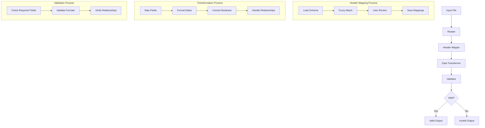

# Data Transformation and Validation Tool

A robust Python-based tool for transforming and validating user access management data from various input formats into a standardized Excel format.

## Overview

This tool processes input files (Excel/CSV) containing user access management data, performs data transformation and validation according to predefined schema rules, and generates standardized output files.

## Features

- **Multi-format Input Support**: Handles Excel and CSV files
- **Interactive Header Mapping**: Smart column mapping with fuzzy matching
- **Data Validation**: Comprehensive validation based on schema rules
- **Data Transformation**: Standardizes data formats including:
  - Date/time to ISO 8601
  - Boolean values to Yes/No
  - User identification fields
  - Relationship mappings
- **Error Handling**: Separate output files for valid and invalid records
- **Logging**: Detailed logging for debugging and audit trails

## System Requirements

- Python 3.8+
- zsh shell (for automated setup)

## Quick Start

1. Clone the repository:
```bash
git clone https://github.com/yourusername/data-transformation-tool.git
cd data-transformation-tool
```

2. Place your input file(s) in the `uploads` directory

3. Run the initialization script:
```bash
chmod +x init.sh
./init.sh
```

The script will:
- Create a virtual environment
- Install required dependencies
- Process files from the `uploads` directory
- Generate output files in the `converts` directory

## Manual Installation (Alternative)

If you prefer manual setup:

1. Create a virtual environment:
```bash
python -m venv .venv
source .venv/bin/activate  # On Windows: .venv\Scripts\activate
```

2. Install dependencies:
```bash
pip install -r requirements.txt
```

3. Run manually:
```bash
python src/main.py <input_file_or_directory>
```

## Project Structure

```
├── init.sh                    # Automated setup and execution script
├── src/
│   ├── main.py               # Entry point
│   ├── reader.py             # Input file reader
│   ├── header_mapper.py      # Column mapping logic
│   ├── data_transformer.py   # Data transformation
│   ├── validator.py          # Data validation
│   ├── output_generator.py   # Output file generation
│   ├── schema.json          # Data schema definition
│   └── header_mappings.yaml # Saved header mappings
├── uploads/                  # Input directory
├── converts/                 # Output directory
├── tests/                   # Test files
├── requirements.txt         # Dependencies
└── README.md               # This file
```

## Data Flow



## Schema Rules

### Entity Data
- **Users**:
  - Required: user_id/username/email
  - Required: first_name + last_name OR full_name
  - is_active: "Yes" or "No"
  - Dates in ISO 8601 format

- **Groups**:
  - Required: group_id or group_name
  
- **Roles**:
  - Required: role_id or role_name
  
- **Resources**:
  - Required: resource_id or resource_name

### Relationships
- User Groups
- User Roles
- Group Roles
- User Resources
- Role Resources

## Error Handling

The tool generates two output files:
1. `converted_[filename].xlsx`: Contains valid records
2. `invalid_records_[filename].xlsx`: Contains invalid records with error details

## Logging

- Log file: `validation.log`
- Includes:
  - Transformation errors
  - Validation failures
  - Processing statistics

## Interactive Features

- Smart header mapping with fuzzy matching
- Preview of data samples during mapping
- Ability to save and reuse mappings
- Interactive confirmation of mappings
- Option to skip optional fields
- Progress indicators during processing

## Best Practices

1. **Input Files**:
   - Place files in the `uploads` directory
   - Use either Excel (.xlsx) or CSV format
   - Ensure data consistency within columns

2. **Header Mapping**:
   - Review automatic mappings carefully
   - Use saved mappings for consistency
   - Map all mandatory fields

3. **Data Validation**:
   - Check invalid records output
   - Review validation.log for errors
   - Correct source data if needed

## Troubleshooting

Common issues and solutions:

1. **Environment Setup**:
   ```bash
   # If init.sh fails, try:
   chmod +x init.sh
   ./init.sh
   ```

2. **Input Files**:
   - Ensure files are not open in other applications
   - Check file permissions
   - Verify file format (Excel/CSV)

3. **Processing Errors**:
   - Check validation.log for details
   - Ensure all mandatory fields are mapped
   - Verify data formats match schema requirements

## Contributing

1. Fork the repository
2. Create a feature branch (`git checkout -b feature/AmazingFeature`)
3. Commit changes (`git commit -m 'Add some AmazingFeature'`)
4. Push to the branch (`git push origin feature/AmazingFeature`)
5. Open a Pull Request

### Development Guidelines

- Follow PEP 8 style guide
- Add tests for new features
- Update documentation
- Maintain backward compatibility

## License

This project is licensed under the MIT License - see the LICENSE file for details.

## Support

For support:
1. Check the documentation
2. Review closed issues
3. Open a new issue with:
   - Description of the problem
   - Steps to reproduce
   - Expected vs actual behavior
   - Log files and screenshots

## Acknowledgments

- Thanks to all contributors
- Built with Python and open-source libraries
- Inspired by real-world data transformation needs
